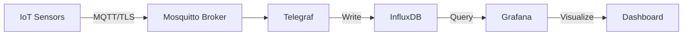

# Pearl Factory - IoT Monitoring Infrastructure with Terraform

## 📋 Overview

Infrastructure as Code (IaC) implementation for IoT monitoring system using Terraform. This project migrates a Docker Compose-based smart factory monitoring stack to Terraform for better infrastructure management, versioning, and reproducibility.

## 🏗️ Architecture



## 🚀 Tech Stack

- **Terraform** - Infrastructure as Code
- **Docker** - Container runtime
- **Mosquitto** - MQTT broker with TLS/SSL
- **Telegraf** - Metrics collection agent
- **InfluxDB 2.0** - Time-series database
- **Grafana** - Monitoring dashboard

## 📁 Project Structure

```
.
├── main.tf                         # Main infrastructure definition
├── variables.tf                    # Variable declarations
├── terraform.tfvars.example        # Example variable values
├── conf/
│   ├── mosquitto.conf.tpl         # Mosquitto config template
│   └── telegraf.conf.tpl          # Telegraf config template
├── certs/                          # SSL certificates (create manually)
│   ├── ca.crt
│   ├── server.crt
│   ├── server.key
│   └── pwfile                      # Mosquitto password file
├── grafana/
│   ├── provisioning/
│   │   ├── dashboards/
│   │   │   └── dashboard.yml      # Dashboard provisioning config
│   │   └── datasources/
│   │       └── influxdb.yml       # Datasource provisioning config
│   └── dashboards/
│       └── dashboard-overview.json # Dashboard JSON definition
```

## 🔧 Prerequisites

- Terraform >= 1.0
- Docker Engine >= 20.10
- OpenSSL (for certificate generation)

## 📝 Installation

### 1. Clone the repository

```bash
git clone https://github.com/yourusername/pearl_terraform
cd pearl_terraform
```

### 2. Generate SSL certificates

```bash
# Generate CA key and certificate
openssl genrsa -out certs/ca.key 2048
openssl req -new -x509 -days 365 -key certs/ca.key -out certs/ca.crt

# Generate server key and certificate
openssl genrsa -out certs/server.key 2048
openssl req -new -key certs/server.key -out certs/server.csr
openssl x509 -req -in certs/server.csr -CA certs/ca.crt -CAkey certs/ca.key -CAcreateserial -out certs/server.crt -days 365
```

### 3. Create Mosquitto password file

```bash
# Install mosquitto-clients if not available
sudo apt-get install mosquitto-clients

# Create password file
mosquitto_passwd -c certs/pwfile sensor
```

### 4. Configure variables

```bash
cp terraform.tfvars.example terraform.tfvars
# Edit terraform.tfvars with your values
```

Example `terraform.tfvars`:
```hcl
influxdb_token     = "my-super-secret-token"
influxdb_org       = "pearl-factory"
influxdb_bucket    = "sensors"
influxdb_username  = "admin"
influxdb_password  = "adminpass123"
telegraf_username  = "sensor"
telegraf_password  = "sensorpass"
mosquitto_port     = 8883
grafana_user       = "admin"
grafana_password  = "adminpass123"
```

### 5. Deploy infrastructure

```bash
# Initialize Terraform
terraform init

# Review planned changes
terraform plan

# Apply configuration
terraform apply
```

## 📊 Access Services

After deployment, services are available at:

- **Grafana Dashboard**: http://localhost:3001
  - Default credentials: admin/adminpass123
- **InfluxDB**: http://localhost:8087
- **MQTT Broker**: ssl://localhost:8884

## 🔒 Security Considerations

- All sensitive variables are marked as `sensitive` in Terraform
- MQTT communication is secured with TLS/SSL
- Password files and certificates are excluded from version control
- Use environment variables or secure secret management in production

## 📈 Monitoring Metrics

The dashboard monitors:
- Real-time message flow (messages/10s)
- Active sensor count
- Sensor health status
- Average values for:
  - Temperature (°C)
  - Humidity (%)
  - Pressure (hPa)
  - Vibration levels
  - Production rate (units/hour)

## 🛠️ Customization

### Adding new sensors

Edit `conf/telegraf.conf.tpl`:
```toml
topics = [
  "factory/sensor/temperature",
  "factory/sensor/humidity",
  "factory/sensor/your-new-sensor"  # Add here
]
```

### Modifying dashboard

1. Edit dashboard in Grafana UI
2. Export JSON (Dashboard settings → JSON Model)
3. Replace `grafana/dashboards/dashboard-overview.json`
4. Run `terraform apply`

## 🧹 Cleanup

```bash
# Remove all resources
terraform destroy
```

## 🔄 Migration from Docker Compose

Key improvements over Docker Compose:
- **State management** - Track infrastructure changes
- **Plan/Apply workflow** - Preview changes before applying
- **Variables** - Environment-specific configurations
- **Dependency management** - Explicit resource dependencies
- **Provisioning** - Automatic dashboard/datasource setup

## 📚 References

- [Terraform Docker Provider](https://registry.terraform.io/providers/kreuzwerker/docker/latest/docs)
- [InfluxDB 2.0 Documentation](https://docs.influxdata.com/influxdb/v2.0/)
- [Grafana Provisioning](https://grafana.com/docs/grafana/latest/administration/provisioning/)
- [Mosquitto Configuration](https://mosquitto.org/man/mosquitto-conf-5.html)

## 🤝 Contributing

1. Fork the repository
2. Create your feature branch (`git checkout -b feature/AmazingFeature`)
3. Commit your changes (`git commit -m 'Add some AmazingFeature'`)
4. Push to the branch (`git push origin feature/AmazingFeature`)
5. Open a Pull Request

## 📄 License

This project is licensed under the MIT License - see the [LICENSE](LICENSE) file for details.

## 👤 Author

**Your Name**
- GitHub: [@yourusername](https://github.com/grademe12)
- Blog: [yourblog.com](https://woosupar.dev)

## 🙏 Acknowledgments

- Original Docker Compose implementation
- Smart Factory monitoring team
- Open source community

---

**Note**: Remember to update the absolute paths in `main.tf` to use relative paths or variables for better portability.

This README written by Claude.ai
